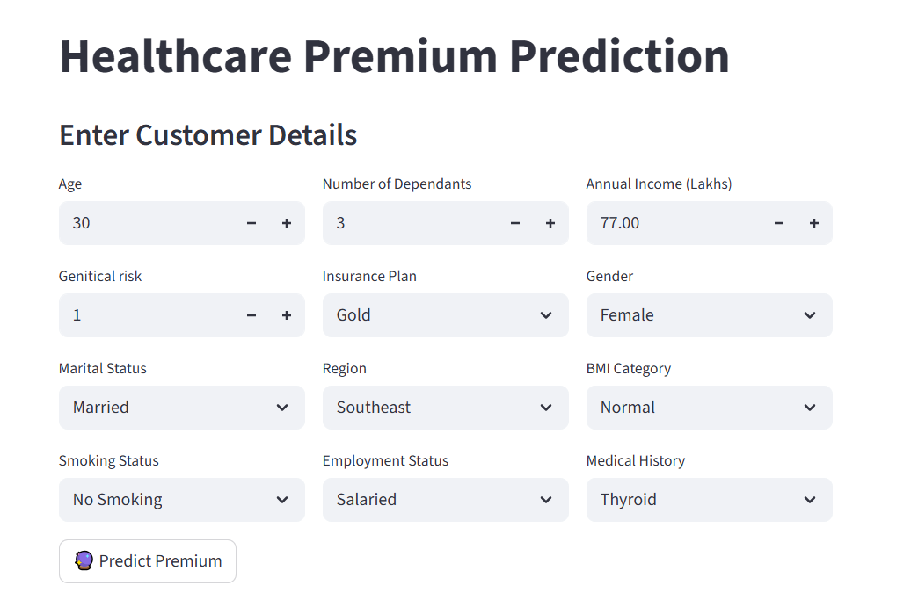
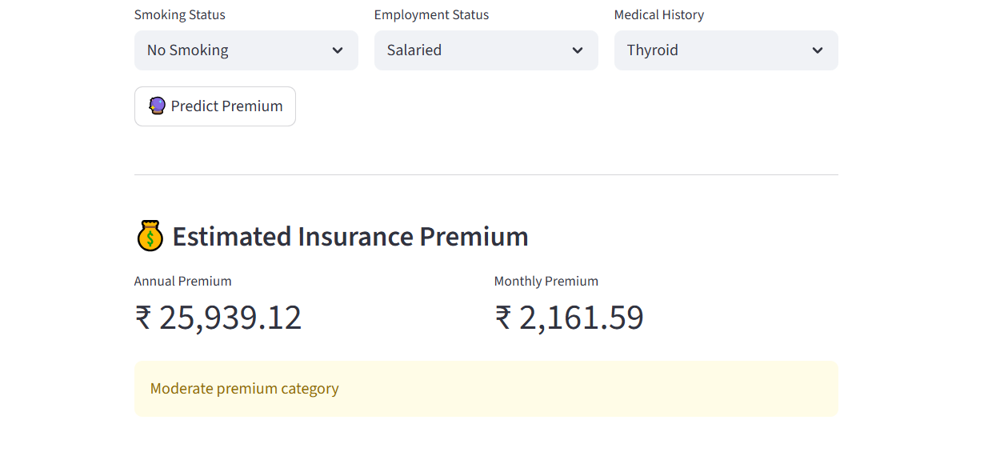

# 🏥 ML - Healthcare-Premium-Prediction

A **Machine Learning application** that predicts the **health insurance premium** for a customer based on demographic, financial, and health-related attributes.

The system uses customer information such as age, income, BMI category, smoking habits, and medical history to estimate the **annual insurance premium**.  
The prediction is delivered through an **interactive Streamlit web application**.

---

## Project Structure

- **app.py**  
  Contains the **Streamlit web application** where users enter customer details and receive healthcare premium predictions.

- **prediction.py**  
  Includes the **data preprocessing, feature transformation, and prediction logic** used to prepare inputs and generate the premium estimate.

- **model.pkl**  
  Stores the **trained machine learning model** used to predict the healthcare insurance premium.

- **requirements.txt**  
  Lists all Python libraries required to run the application.

- **images/**  
  Contains screenshots of the application used in the README documentation.

- **README.md**  
  Provides an overview of the project, installation steps, usage instructions, and project details.

  ---

## Setup Instructions

1. **Clone the repository**:
   ```bash
   git clone https://github.com/yourusername/healthcare-premium-prediction.git
   cd healthcare-premium-prediction
   ```
2. **Install dependencies:**
   ```commandline
   pip install -r requirements.txt
   ```

3. **Run the Streamlit app:**
   ```commandline
   streamlit run app.py
   ```
---

# 📌 Project Overview

Health insurance companies determine premiums by evaluating several risk factors related to an individual’s health and lifestyle.

This project builds a **machine learning model that predicts healthcare insurance premiums** based on:

- Personal demographics
- Lifestyle factors
- Medical history
- Financial information

The goal is to demonstrate how **data-driven models can assist in insurance pricing and risk evaluation**.

---

# 🖥️ Application Interface

## Main Application Screen



Users enter customer details such as age, income, medical history, and lifestyle information.

---

## Prediction Result



The application predicts the **annual healthcare premium** based on the provided inputs.

---

# ⚙️ Features

✔ Predicts **health insurance premium**  
✔ Interactive **Streamlit web interface**  
✔ Handles **categorical and numerical inputs**  
✔ Real-time **premium prediction**  
✔ Clean **dashboard-style layout**

---

### Model Limitation and Improvement

During model evaluation, it was observed that prediction error was generally low across most age groups. However, the error was relatively higher for customers in the **18–25 age group**.

This occurred due to **limited training data available for this age segment**, which affected the model’s ability to accurately learn patterns for younger customers.

To address this issue:

- **Segmentation logic** was applied to better analyze predictions across different age groups.
- It was recommended to **collect additional data for the 18–25 segment** to improve model performance.
- Future model training will include **more balanced age distribution** to reduce prediction bias.

This approach helps ensure more reliable premium predictions across all customer segments.

# 🧠 Machine Learning Workflow

The project follows a standard **machine learning pipeline**.

### 1️⃣ Data Preprocessing
- Handling categorical variables
- Feature encoding
- Data cleaning

### 2️⃣ Feature Engineering

Important features used in the model include:

- Age
- Number of dependants
- Annual income
- Genetic risk score
- BMI category
- Smoking status
- Medical history

### 3️⃣ Model Training

A regression model was trained to estimate the **insurance premium amount** based on customer risk characteristics.

---

# 📊 Input Features

| Feature | Description |
|------|-------------|
| Age | Age of the customer |
| Number of Dependants | Family members dependent on the customer |
| Annual Income | Income in lakhs |
| Genetic Risk | Health risk level based on family history |
| Insurance Plan | Bronze / Silver / Gold |
| Gender | Male / Female |
| Marital Status | Married / Unmarried |
| Region | Customer region |
| BMI Category | Normal / Overweight / Obesity / Underweight |
| Smoking Status | No Smoking / Occasional / Regular |
| Employment Status | Salaried / Self-Employed / Freelancer |
| Medical History | Existing medical conditions |

---

# 📈 Output

The application provides the following prediction results:

### Estimated Healthcare Premium

The model predicts the **annual insurance premium** based on the provided customer details.

Example: 

Annual Premium: ₹ 42,500

---

### Monthly Premium Estimate

For better usability, the application also calculates the **estimated monthly premium**.

Example:

Monthly Premium: ₹ 3,541

---

### Premium Category

The predicted premium is also categorized into **risk-based premium levels** to help interpret the result.

Example:
Low Premium Category

Moderate Premium Category

High Premium Category

